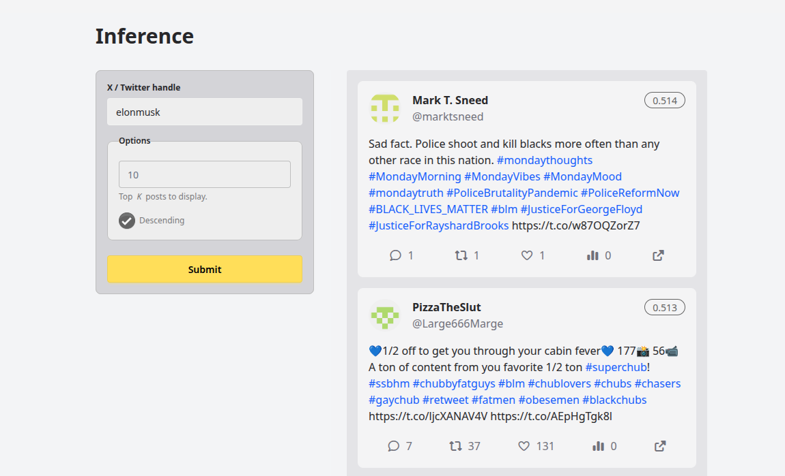

(mvps)=

# MVPs

## MVP 1.0: CLI Tool

This MVP showcases the core idea of how inference will work in future MVPs and the final production build.

To run inference, simply run `uv run mvps/mvp.py --user <user_id>` or `uv run mvp.py --username <username>`. The results will be printed as a `list` of `tuple`'s that contain the PocketBase `Record` object alongside its score/probability, i.e `(<Record: 7a13kcka0>, 0.52019314)`.

## MVP 2.0: Streamlit

This MVP showcases the implementation of the core inference functionality with a basic user interface.

To first run inference, we need to run the Streamlit server first by running `uv run streamlit run mvps/streamlit_mvp.py`. This requires working connection to the PocketBase database.

## MVP 3.0: Production Build

This MVP is the final iteration of MVPs. It contains the study details, author information and ofcourse the main inference functionality.



The website can be accessed through https://capstone.ustp.party/.

### Hosting

To host this app, we need to host both the FastAPI backend and Svelte frontend.

#### Backend

First, clone the repo.
```bash
git clone https://github.com/iragca/capstone2-project-2.git
```
Make sure to have an `.env` file in the root directory.

The required variables are detailed as follows:

```bash
# Add the secret details yourself
X_USERNAME=
X_PASSWORD=
X_TOTP=
POCKETBASE_EMAIL=
POCKETBASE_PASSWORD=
POCKETBASE_URL=https://capstone.gari-homelab.party
```

And then do the initial project setup as specified in the [introduction](../introduction.md#project-setup).

Then finally,

```bash
uv run fastapi run mvps/mvp3_backend.py --port 8001
```

#### Frontend

The source code for the frontend is actually on a different repo. So dependencies and requirements will be different.

Clone that repo.

```bash
git clone https://github.com/iragca/capstone2-mvp3-frontend-cfworkers.git
```

Make sure to install [npm](https://www.npmjs.com/).
Then install dependencies

```bash
npm install
```

Build the website

```bash
npm run build
```

Then run the production build

```bash
npm run preview
```

##### Alternative frontend setup

You can host the frontend on Cloudflare Workers (the current setup).

The documentation for that is located [here](https://developers.cloudflare.com/workers/framework-guides/web-apps/svelte/).

### Tech Stack

- Frontend: Svelte (Cloudflare Workers)
- Backend: FastAPI (Locally deployed/Railway)
