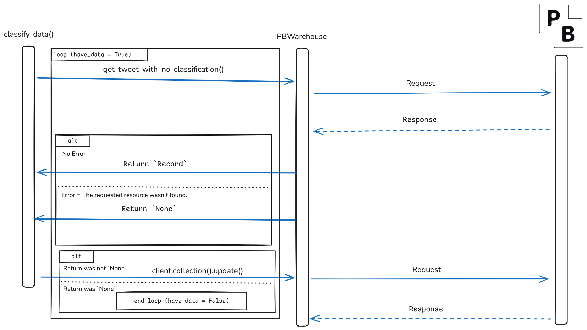

# Classifying

As the first preliminary step to training, we classify the tweet data into 3 categories based on the text.

- 0: Extremist
- 1: Normal
- 2: Offensive

We use [HateXplain](https://huggingface.co/Hate-speech-CNERG/bert-base-uncased-hatexplain) to classify the data. This is done in a script in the [`main.py`](https://github.com/iragca/capstone-project-2/blob/master/main.py) file. To classify data simply run:

```bash
uv run main.py classify-data
```



When classifying, we fetch a single record from the database (dataset collection) that isn't classified as one of the 3 classes, classify the record, then update the corresponding record in the database.

This process ends when there are no more records that is not classified or is forcefully stopped by the user.
