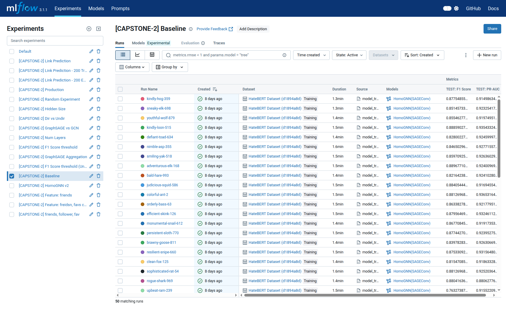

# MLOps

To maintain a streamlined supervision of training runs, we use [mlflow](https://mlflow.org/). Which allows us to view, compare and revisit past runs. The runs include data about the hyperparameters, model artifacts, and system resources used. All this data can be download in `csv` format if needed.

The only [mlflow instance](https://mlflow.gari-homelab.party/) we use is on a home server ran by one of the members to minimize cloud costs.

